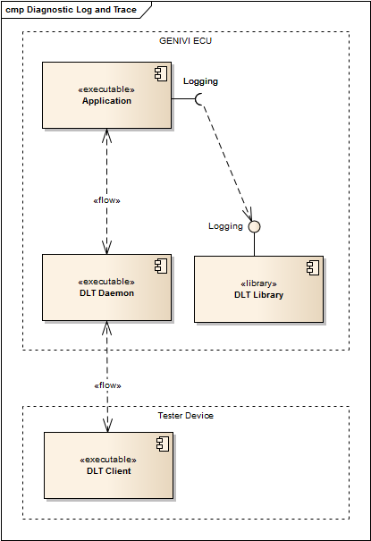
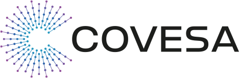

# Diagnostic Log and Trace


[]( https://github.com/COVESA/dlt-daemon/actions/workflows/cmake-ctest.yml)
[](https://github.com/COVESA/dlt-daemon/actions/workflows/codeql-analysis.yml)
[](https://github.com/COVESA/dlt-daemon/actions/workflows/pages/pages-build-deployment)

**Code coverage reports online** 📄 [LCOV - code coverage report](https://COVESA.github.io/dlt-daemon/dlt_lcov_report/index.html)

# Diagnostic Log and Trace

Welcome to COVESA Diagnostic Log and Trace (DLT). If you are familiar with DLT
and want to know what's new, check the [Release Notes](ReleaseNotes.md).

**New to DLT? Great! Welcome aboard.** We prepared a brief [overview](#overview)
for you as well as some information on how to [get started](#get-started)
immediately. After you made yourself familiar with the basic mechanics of DLT,
you can [learn more](#learn-more) about advanced concepts and features.

## Overview

COVESA DLT provides a log and trace interface, based on the standardised
protocol specified in the
[AUTOSAR standard 4 DLT](https://www.autosar.org/fileadmin/standards/R22-11/CP/AUTOSAR_SWS_DiagnosticLogAndTrace.pdf).
It is used by other COVESA components but can serve as logging framework for
other applications without relation to COVESA.

The most important terms and parts are depicted in the following figure. Please
refer to [Glossary](doc/dlt_glossary.md) for a full overview over DLT-specific
terms.



- A **DLT User** essentially is an application that serves its respective (not
DLT-related) purpose and produces DLT log messages. It utilizes the DLT library
to craft and transmit these messages.
- The **DLT Library** provides a convenient API to DLT Users (i.e. applications)
to create DLT log messages and hand them over to the DLT Daemon. If the latter
is not avilable, the library will cache the messages in a ring buffer so they
don't get lost immediately.
- The **DLT Daemon** is the DLT communication interface of an ECU. It collects
and buffers log messages from one or more DLT users running on the ECU and
provides them to DLT clients upon their request. The daemon also accepts control
messages from the clients to adjust the daemon's or the aplications' behaviour.
- A **DLT Client** receives and consumes the log messages from DLT Users by
fetching them from DLT Daemons. It may also issue control messages to control
the behaviour of a DLT Daemon or its connected DLT Users. A DLT client can even
transmit user-defined data to a DLT User through so-calles injection messages.

This is only the simplest of all use cases that you will further pursue in the
[Get Started](#get-started) section. Once you want to [learn more](#learn-more),
you will find that the repository contains advanced features utilizing several
adaptors and console utilities as well as test applications.

## Get Started
In this section, you can learn how to [build and install](#build-and-install)
DLT. Then you can choose to [run a DLT demo](#run-a-dlt-demo) setup or to start
by [developing your own DLT-featured application](#develop-your-own-dlt-featured-application).

### Build and install

The following packages need to be installed in order to be able to build and
install DLT daemon:

- cmake
- zlib
- dbus
- json-c (only required for dlt-receives extended filtering)

On Ubuntu those dependencies can be installed with the following command:

```bash
sudo apt-get install cmake zlib1g-dev libdbus-glib-1-dev build-essential
optional: sudo apt-get install libjson-c-dev # in case you want to use dlt-receives extended filtering
```

Then proceed to download DLT if you haven't already. We recommend cloning the
repository, but downloading and extracting a zip-archive is fine as well.
```bash
cd /path/to/workspace
git clone https://github.com/COVESA/dlt-daemon.git
```

To build and install the DLT daemon, follow these steps:

```bash
cd /path/to/workspace/dlt-daemon
mkdir build
cd build
cmake ..
make
optional: sudo make install
optional: sudo ldconfig # in case you executed make install
```
CMake accepts a plethora of [build options](doc/dlt_build_options.md) to
configure the build to suit your needs.

### Run a DLT demo
In case you haven't had a look at the brief [overview](#overview), now would be
the perfect occasion to learn about the most important terms and to get an idea
where data is buffered. Then go on with our guide on [how to set up a DLT demo
setup](doc/dlt_demo_setup.md).

### Develop your own DLT-featured application

Now that you have seen DLT in action, you probably want to develop your own
applications using DLT. You will find everything you need in our ["DLT for
Application Developers" guide](doc/dlt_for_developers.md).

A hint: If you want to read the API documentation, you have to build it locally
at the moment. The API documentation is generated with _doxygen_. To build it,
run cmake with the ```-DWITH_DOC=ON``` option, e.g.:

```bash
mkdir build
cd build
cmake -DWITH_DOC=ON ..
make doc
```

### Build DLT debian package

To build the DLT debian package for your own purpose, follow these steps:

```bash
dpkg-buildpackage -us -uc
```

## Learn more
Once you got your feet wet with developing your first application, you might
want to learn more. Find out about DLT's [advanced topics](#advanced-topics),
learn how to [configure, control and interface](#configure-control-and-interface)
DLT or study its internals by checking out the [design
specifications](./doc/dlt_design_specification.md).

### Advanced Topics
The COVESA DLT implementation is capable of by far more than to "just" send log
message. You will get an overview of advanced features in this section. Follow
the links to learn more about the respective concept.

| Document | Description |
|----|----|
| [Build Options](./doc/dlt_build_options.md) | The CMake build system provides a large amount of build options. They let you turn on or off certain features and provide alternative implementation details. |
| [LogStorage](doc/dlt_offline_logstorage.md) | The DLT Daemon as well as the DLT libary provide buffers for caching log data during absence of a consumer. However, some use cases require to write large amounts of log message e.g. to mass storages for long term storage or because no other means of exfiltrating the log data is available. |
| [MultiNode](doc/dlt_multinode.md) | A DLT Daemon can run as a gateway to connect multiple passive nodes. Each passive node has its owns DLT Applications and runs its own daemon. The gateway node connects to all of them, collects the logs and routes them to the DLT Client. |
| [Extended Network Trace](doc/dlt_extended_network_trace.md) | Normal DLT messages are limited in size. To overcome this limitation the feature network trace message allows the user to send or truncate messages which would not fit into a normal DLT message. |
| [DLT Filetransfer](doc/dlt_filetransfer.md) | Although not originally designed for this, files can be transmitted over DLT. A corresponding DLT Client (e.g. DLT Viewer) can receive and decode them accordingly. |
| [DLT KPI](doc/dlt_kpi.md) | Valueable status information about the monitored system can be read via DLT as well. The information under `/proc` of the target system is at your hands easily. |
| [DLT Core Dump Handler](/doc/dlt_cdh.md) | This tool collects and extracts debug information then utilize [DLT Filetransfer](doc/dlt_filetransfer.md) to transfer the information to client. |

### Configure, Control and Interface

There is still lots to discover about DLT. If you turn on the generation of
manpages with the cmake option ```-DWITH_MAN=ON``` you can learn how to
configure DLT to exactly suit your needs, how to control the behvaiour of
running instances and how to interface DLT with existing system through
provided adaptors.

The man pages are generated with *pandoc*, which also needs *asciidoc* as dependency.

Build manpages (initally or because something changed) with e.g.
```bash
mkdir build
cd build
cmake -DWITH_MAN=ON ..
make generate_man
```

| Document | Description |
|----|----|
| *Configuration* ||
|[dlt-daemon(1)](doc/dlt-daemon.1.md) | How to start DLT-Daemon |
|[dlt.conf(5)](doc/dlt.conf.5.md) | Configure the DLT framework to reflect your use case|
| *Control running instances of DLT*||
|[dlt-receive(1)](doc/dlt-receive.1.md)| Receive DLT messages from daemon and print or store the log messages. |
|[dlt-control(1)](doc/dlt-control.1.md)| Send control messages to daemon. |
|[dlt-logstorage-ctrl(1)](doc/dlt-logstorage-ctrl.1.md)| Send a trigger to daemon to connect/disconnect certain logstorage device, or send a demand to sync data the internal buffer into logstorage file. |
|[dlt-passive-node-ctrl(1)](doc/dlt-passive-node-ctrl.1.md)| Send a trigger to daemon to connect/disconnect passive daemon. |
| *Interfacing DLT* ||
|[dlt-system(1)](doc/dlt-system.1.md) | DLT-System provides a way to directly access system logs via DLT |
|[dlt-system.conf(5)](doc/dlt-system.conf.5.md) | Configure DLT-System |
|[dlt-adaptor-stdin(1)](doc/dlt-adaptor-stdin.1.md)| Adaptor for forwarding input from stdin to daemon. |
|[dlt-adaptor-udp(1)](doc/dlt-adaptor-udp.1.md)| Adaptor for forwarding received UDP messages to daemon. |
|[dlt-convert(1)](doc/dlt-convert.1.md)| Convert DLT files into human readable format. |
|[dlt-sortbytimestamp(1)](doc/dlt-sortbytimestamp.1.md)| Read log messages from DLT file, sort by timestamp, and store them again. |
|[dlt-qnx-system(1)](doc/dlt-qnx-system.md) | Access system logs in QNX with DLT |

## Contribution

Start working, best practice is to commit smaller, compilable pieces during the
work that makes it easier to handle later on.

If you want to commit your changes, create a
[Pull Request](https://github.com/covesa/dlt-daemon/pulls) in Github. Please
make sure to follow the
[Rules for commit messages](https://at.projects.covesa.org/wiki/display/PROJ/Rules+for+Commit+Messages)

### Coding Rules

This project is now using clang-format as replacement of uncrustify.

For convenience, any code changes will be harmonized before commit by hooks/pre-commit.

- Install clang-format

- Install pre-commit script by:

  ```bash
  cp scripts/pre-commit.sample .git/hooks/pre-commit
  ```

- Configuration: .clang-format

For reference to clang-format, you can check with:
[Configurator](https://zed0.co.uk/clang-format-configurator/)

## Known issues

List of open issues can be found on
[Github](https://github.com/COVESA/dlt-daemon/issues)

- DLT library: Usage of dlt\_user\_log\_write\_float64() and DLT\_FLOAT64()
  leads to "Illegal instruction (core dumped)" on ARM target.
- DLT library: Nested calls to DLT\_LOG\_ ... are not supported, and will lead
  to a deadlock.
- For Non linux platforms [eg: QNX] IPC supported is UNIX\_SOCKET. For Linux
  Platforms both IPC FIFO and UNIX\_SOCKET are supported

## Software/Hardware

Developed and tested with Ubuntu Linux 16 64-bit / Intel PC

## License

Full information on the license for this software is available in the "LICENSE"
file.
Full information on the license for the cityhash code is available in "COPYING"
file in src/core\_dump\_handler/cityhash\_c.


## Contact

Methner, Michael <mmethner@de.adit-jv.com>,
Le Van, Khanh <Khanh.LeVan@vn.bosch.com>


