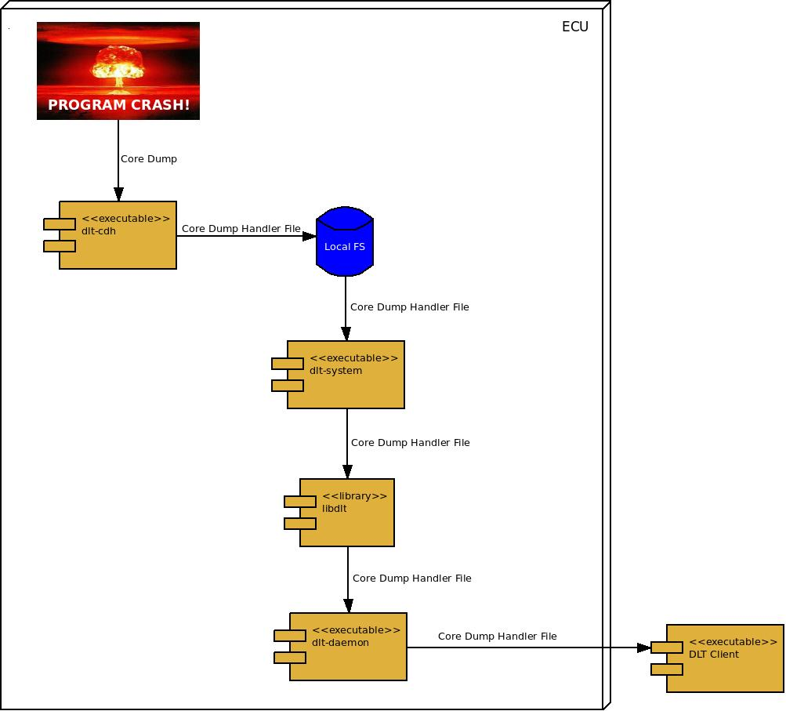

# DLT Core Dump Handler

Back to [README.md](../README.md)

## Overview

When a program crash occurs on the system, the Core Dump Handler is triggered to
extract relevant information from the core dump generated by the system. It
stores this extracted information in the ECU's file system as Core Dump Handler
Files. These files are transported via the [DLT Filetransfer](dlt_filetransfer.md)
mechanism. The transferred information can be combined and integrated into the
developer toolchain (gdb, Release SW, etc.).



## Integration

### To build the core dump handler

Add

`-DWITH_DLT_COREDUMPHANDLER=ON -DTARGET_CPU_NAME={i686|x86_64}`

options to cmake. The core dump handler code currently supports the i686 and
x86\_64 architecture.

### Temporary activation as replacement for default crash handler until next reboot

As *root* (not sudo) execute the following:

`echo "|/usr/local/bin/dlt-cdh %t %p %s %e" > /proc/sys/kernel/core_pattern`

NOTE: replace */usr/local/bin* with the path dlt-cdh has been installed to. This
instructs the kernel to pipe a core dump as standard input to dlt-cdh together
with the following parameters:

- %t time of dump
- %p PID of dumped process
- %s number of signal causing dump
- %e executable filename

See

`man core`

for details.

### Persistent activation as replacement for default crash handler

In */usr/lib/sysctl.d/* the file *50-coredump.conf* has to be created which is
done automatically by

`make install`

Unfortunately - at least on Fedora systems - abrt has to be removed with

`yum remove abrtd*`

because it ruthlessly overwrites our change at every boot. The core dump handler
can be activated then without reboot by running

`sysctl -p /usr/lib/sysctl.d/50-coredump.conf`

### Configuration of [DLT Filetransfer](dlt_filetransfer.md) for usage with dlt-cdh

Make sure the following is set in the "Filetransfer Manager" section of
*/etc/dlt-system.conf*:

```
...
FiletransferEnable = 1
...
FiletransferDirectory = /var/core
...
```

### Generation of core dump

When a crash happens the kernel invokes dlt-cdh and passes it the core dump as
standard input. dlt-cdh does the following tasks:

- check if enough disk space available
- create target directories if not existing:
  - /var/core
  - /var/core\_tmp
  - /tmp/.core\_locks
- clean /var/core\_tmp
- retrieve context data mainly from /proc fs of the crashed process to a temporary context file in text format
- initialise core dump
- read ELF headers and notes to temporary core dump output file
- move context file and core dump to /var/core
- create id which identifies the crash

After the files have been moved to /var/core the [DLT Filetransfer](dlt_filetransfer.md)
mechanism ensures that they are sent to connected clients.

## AUTHOR

Lutz Helwing <Lutz_Helwing (at) mentor (dot) com>

## COPYRIGHT

Copyright (C) 2011 - 2015 BMW AG. License MPL-2.0: Mozilla Public License version 2.0 <http://mozilla.org/MPL/2.0/>.
