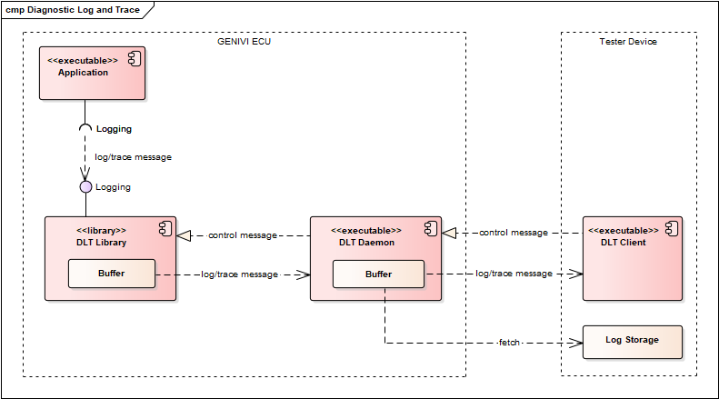
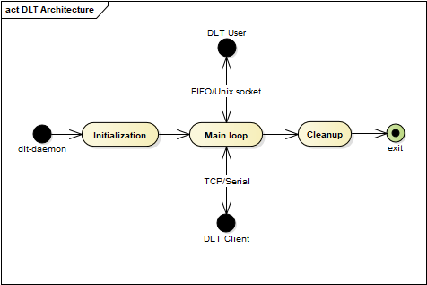

***
SPDX license identifier: MPL-2.0

Copyright (C) 2011-2015, BMW AG

This file is part of COVESA Project DLT - Diagnostic Log and Trace.

This Source Code Form is subject to the terms of the
Mozilla Public License (MPL), v. 2.0.
If a copy of the MPL was not distributed with this file,
You can obtain one at http://mozilla.org/MPL/2.0/

For further information see http://www.covesa.org/
***

# DLT Design Specification
Alexander Wenzel <Alexander.AW.Wenzel@bmw.de>
0.0.1, 2012/10/10: Initial version

Luong Hong Duy Khanh <KHANH.LUONGHONGDUY@vn.bosch.com>
0.0.2, 2020/04/10: Update and convert to markdown format

## Purpose
This document specifies the usage of the DLT daemon v2 and also the internal
functionality of the DLT daemon v2. The DLT daemon v2 is a complete rework of
the DLT daemon v1, which is part of the COVESA 1.0 release.

The DLT daemon component is based on the
[AUTOSAR 4.0 standard DLT](https://www.autosar.org/fileadmin/user_upload/standards/classic/4-0/AUTOSAR_SWS_DiagnosticLogAndTrace.pdf)
(the current latest version is
[R19-11](https://www.autosar.org/fileadmin/user_upload/standards/classic/19-11/AUTOSAR_SWS_DiagnosticLogAndTrace.pdf)).

## Overview

The DLT daemon is the central component in COVESA, where logs and traces are
gathered from the DLT user and different applications, stored optionally
temporarily or permanently in a file in the ECU. The DLT daemon forwards all
logs and traces to a connected DLT client application, which can run directly
on the COVESA system or more likely on an external tester device.

The DLT client can send control messages to the daemon, e.g. to set individual
log levels of applications and contexts or get the list of applications and
contexts registered in the DLT daemon.

In DLT, a log message contains debug information like state changes or value
changes and a trace message contains information, which has passed via the
Virtual Function Bus (VFB).

## Architecture

### DLT daemon

The DLT daemon is the central component between the DLT clients and one or more
applications using the DLT user library.

#### Overview
The DLT daemon is a standalone application which is running as the center of
management and this is implemented as a single-thread process. The DLT daemon
communicates with the DLT clients over TCP/IP connections or over a serial line
with the applications using the DLT user library over named pipes (FIFOs),
UNIX sockets or VSOCK sockets based on compile time configuration.

The message format is specified in the DLT AUTOSAR Standard. More details
concerning the exchanged user messages and their content can be found in
[chapter 6](https://www.autosar.org/fileadmin/user_upload/standards/adaptive/19-11/AUTOSAR_SWS_LogAndTrace.pdf#page=10).

The main time, the DLT daemon executes the main loop, in which file and socket
descriptors are watched (via poll()). If a message is received, the DLT daemon
reacts.

Here is a rough schematic, how the DLT daemon is structured:

#### Initialization
During initialization of the DLT daemon, the following steps occur:

- Option handling.
- Option file parsed. The most important configuration files is dlt.conf
- Initialization of logging facility for the DLT daemon application. The DLT
daemon application by itself prints to screen, if not in daemon mode. In daemon
mode, it uses the syslog daemon for log messages of the DLT daemon application.
- Then the daemon enters initialization phase 1:
  - Enter daemon mode, if started as daemon
  - Initialize output of messages to the local file
  - Parse filter file, if specified; then set filters for file storage
  - Setup signal handler
  - Open DLT output file, if specified
- After phase 1, the daemon initializes the connection handling:
  - Delete, create and open its own named FIFO /tmp/dlt or UNIX_SOCKET
  - If VSOCK support is enabled in the daemon, open, bind and listen to VSOCK
  socket for incoming application connections.
  - Open, bind and listen to TCP socket for incoming connections
  - Setup and open serial device, if specified
- Then the daemon enters initialization phase 2:
  - Initialize daemon data structures
  - Initialize ring buffer for client connection
  - Check if a runtime configuration exists, if yes load all stored application
  and context ids, as well as all log levels and trace statuses. Store this
  information to a local array.
  - Prepare the main loop
  - Initialize receiver objects for socket and serial connection
  - Initialize binary semaphore
  - Create and start thread(s) for timing messages, sending of these messages is
  disabled at default.
- After phase 2:
  - Initialize the offline logstorage, if the directory path is specified.
  - Prepare timer for system watchdog, if specified.
  - Prepare timer to check incoming events.
  - Prepare timer to send ECU version, if specified.
  - Initialize the gateway mode, if specified, then prepare the timer for gateway.
- Now, the initialization is finished, and the DLT daemon enters the main loop.

#### Main loop
In the main loop, the following things occur:

- Wait for event(s) on the incoming named pipe or socket, the TCP connections
(the one connection for new connections, and all TCP connections from clients),
and possibly on the serial device, via poll() call.
- Distinguish from which socket/file descriptor the connection came, and handle them:
  - Event from TCP server socket (New DLT client to DLT daemon):
    - Create a new TCP connection
    - If the newly created connection is the first TCP connection, send all log
    messages already stored in ring buffer to DLT client.
  - Event from incoming named pipe (FIFO) or UNIX socket and, if enabled, VSOCK
  socket (from DLT user library to DLT daemon):
    - Use dlt receiver to read data
    - As long as there are DLT messages available in received data, the handle
    user messages type can be found at src/shared/dlt_user_shared_cfg.h
    - Move rest of data in front of buffer for next read attempt
  - Event from serial device (DLT client to DLT daemon via serial device)
    - Use other dlt receiver to read data
    - As long as there are DLT messages available in received data:
      - Check for DLT message type control request, and if yes process the request
    - Move rest of data in front of buffer for next read attempt
  - Event from TCP socket (DLT client to DLT daemon via TCP connection)
    - Use other dlt receiver to read data, and check for lost connection
    - As long as there are DLT messages available in received data:
      - Check for DLT message type control request, and if yes process the request
    - Move rest of data in front of buffer for next read attempt

How the received user messages and control messages are handled, is described
in the Appendix.

#### Clean up
Before exiting from DLT daemon, the following cleanup procedures occur:

- Local cleanup
  - Destroy the connection list
  - Free the used memory by the organising structure of file
  - Uninitialise the offline trace
  - Free the used memory by the organising structure of file
  - Delete existing named pipes (FIFOs) or UNIX_SOCKET
  - Cleanup dlt logstorage
- Close UDP connection, if specified
- De-initialize the gateway, if specified. All internal data will be freed
- De-Initialise the dlt daemon structure
  - Clear all contexts in internal context management of specific ecu
  - Clear all applications in internal application management of specific ecu
  - Release and free memory used by dynamic ringbuffer

Now, the cleanup is finished, and the DLT daemon is terminated.
### DLT user library

#### Overview
The DLT user library is linked to each application that wants to use DLT. It
encapsulates the communication with the DLT daemon and provides two interfaces:
the DLT user macro interface and the DLT user functional interface. All macros
from the DLT user macro interface are mapped to functions in the DLT user
functional interface. The DLT user library has one additional thread, called
housekeeper thread, responsible for receiving and sending messages from/to
the DLT daemon.

The DLT user library can be written/read from multiple threads (the threads of
applications which are using DLT APIs, and DLT housekeeper thread which will
send log messages to the daemon). To prevent the concurrent access to the DLT
buffer, parts of functions accessible by the user interface are protected by a
semaphore as well as parts of the function which is called within the thread.

#### Initialization
During initialization, the following things are done:

- Setup internal structure including Application ID and Description (textual)
of application
- Get value from environment variable "DLT_LOCAL_PRINT_MODE". This variable can
be used to control the local printing mode of the DLT user library. If enabled
(either via "AUTOMATIC" or via "FORCE_ON"), all messages, which are prepared to
be sent to the DLT daemon will also be print out locally (as ASCII string). If
the environment variable is set, this value overrides the local print mode which
can be set with the API function dlt_enable_local_print() or with dlt_disable_local_print()
from within the application using the DLT user library. The following values
are allowed:
  - "AUTOMATIC": Local printing is enabled, if NO DLT daemon is running.
  - "FORCE_ON": Local printing is always enabled.
  - "FORCE_OFF": Local printing is always disabled.
- Clear internal context array (dynamically growing in step size
DLT_USER_CONTEXT_ALLOC_SIZE, typically 500). The internal context array is NOT
be kept sorted, as the DLT daemon stores for each registered context the offset
position within this array, and sends this offset position for faster access of
a context within this internal context array. The internal context array
contains one entry for each context:
  - Context ID
  - Log level for this context
  - Trace status for this context
  - Initialize table (dynamically growing in step-size 1) with function pointers
  for callback functions used for injection messages
  - Description (textual) of context
- Initialize ringbuffer for local storage of not sent messages
- Setup signal handler and atexit handler
- Ignore all pipe signals
- Create and open own named pipe (with the name /tmp/dlt<PID>, where <PID> is the
process id of the application using the DLT user library) or UNIX/VSOCK socket IPC
to the DLT daemon
- Open local file for storage, if specified
- Initialize receiver object
- Start housekeeper thread for receiving messages

#### De-Initialization
During de-initialization, the following things are done:

- De-register application (and all contexts belonging to this application) from
DLT daemon
- Stop housekeeper thread
- Close and remove own named pipe to the DLT daemon, if FIFO is used
- Close and remove Unix socket if socket IPC is used
- De-Initialize receiver object
- De-Initialize ringbuffer

#### Register application and context
During register of the application, the following things occur:

- Auto-initialize DLT user library, if necessary
- Store application id to internal structure
- Store application description to internal structure
- Send message DLT_REGISTER_APPLICATION to DLT daemon

During register of a context of the application, the following things occur:

- Auto-initialize DLT user library, if necessary
- Check, if context was already registered, if not, dynamically increment if
required, the context array in step size DLT_USER_CONTEXT_ALLOC_SIZE,
typically 500. Then store one entry for the new context to internal context array.
- Send message DLT_REGISTER_CONTEXT to DLT daemon

#### Unregister context and application

During unregister of context, the following things occur:

- Delete context from internal structures
- Send message DLT_UNREGISTER_CONTEXT to DLT daemon

During unregister of application, the following things occur:

- Delete application from internal structures
- Send message DLT_UNREGISTER_APPLICATION to DLT daemon

#### Handling of messages received from DLT daemon

During housekeeper thread within the DLT user library checks for newly received
messages from the DLT daemon, and handles them in the following way:

- **DLT_USER_MESSAGE_LOG_LEVEL**
  - Store received log level and trace status for the received context to the
  context array.
- **DLT_USER_MESSAGE_INJECTION**
  - Check all registered callbacks for this context:
    - Compare service id of registered callback with received service id, if
    they matches:
      - Call registered callback function.

#### Overflow handling

If the named pipe/socket of the DLT daemon is full, an overflow flag is set and
the message stored in a ring buffer. The next time, a message could be sent to
the DLT daemon, an overflow message is sent first, then the contents of the ring
buffer. If sending of this message was possible, the overflow flag is reset.

#### Send log message

During sending of a log message, the following things occur:

- Auto-initialize DLT user library, if necessary
- Initialize DLT log structure
- Store log level of log message in DLT log structure
- Check if log level is smaller than or equal than the stored log level of the
context, under which the message should be sent. If yes continue, else don't
send this log message. This is a kind of filtering on the DLT user library side.
- In non-verbose mode, insert message id
- Add values (int, string, raw, …) to DLT log structure:
  - Set argument type (only in verbose mode)
  - Copy content of argument to message
  - Set length information of argument
  - Set number of arguments and total length of message
- Create new message with the help of the DLT log structure and handle this message:
  - Initialize new message
  - Add headers (standard header, extended header, storage header, ...) to this
  message
  - If logging to a file is enabled, write the log message to file
  - Print message locally, if requested by environment variable
  - Check if connection to DLT daemon was lost and try to reattach to daemon.
  - Check for overflow flag and try to send overflow message.
  - Try to send message to DLT daemon, and check for return values. This can be:
    - data could not be written
    - handle not open or pipe/socket error
    - other error condition
    - no error, all right
  - If sending failed, put this message in the ring buffer for later sending.
  - Handle these error conditions.

#### Send network trace message

During sending of a network trace message, the following things occur:

- Auto-initialize DLT user library, if necessary
- Check for trace status of network trace message to be sent.
- If Trace status equals on:
  - Initialize DLT log structure
  - Set trace status in DLT log structure to network trace type of message
  - Copy length of network message header to DLT log structure
  - Copy data of network message header to DLT log structure
  - Copy length of network trace payload to DLT log structure
  - Copy data of network trace payload to DLT log structure
  - Create new message with the help of the DLT log structure and handle this message

#### Register callback function for injection message

During registration of a callback function for an injection message, then following
steps are executed:

  - Check if the environment variable DLT\_DISABLE\_INJECTION\_MSG\_AT\_USER is set.
    - If yes:
      - libdlt will ignore all data/messages from dlt-daemon, including:
      loglevel change, custom injection messages ...
    - If no (default):
      - libdlt will handle all data/messages from dlt-daemon as normal.
  - For the specified context, check if service id is already in the table of the
  registered callbacks (this table is dynamically growing in steps of one entry).
    - If yes:
      - Stored service id is set to service id to be registered
      - Stored callback function pointer is set to callback function pointer to
      be registered
    - If no:
      - Increase the number of callbacks for this context
      - Store service id in callback table
      - Store function pointer in callback table

#### Android: Thread termination

On Android, `pthread_cancel` is not available in bionic. So current
implementation uses *SIGUSR1* and `pthread_kill` to terminate housekeeper
thread. Due to this, application which is linked to DLT library should not
define *SIGUSR1*.

### Communication between DLT daemon and DLT user library

The communication mechanism (IPC) used between DLT daemon and DLT user library
are named pipes (FIFOs), UNIX sockets or VSOCK sockets, based on compile time
configuration).

During the startup of the DLT daemon, the DLT daemon creates and opens the IPC
(FIFOs or UNIX_SOCKET) on the configured path called /tmp/dlt. If a DLT user
application using the DLT user library wants to send log messages to the DLT
daemon, this IPC is used.

During the startup of the DLT user application using the DLT user library, it
creates and opens the same IPC type of DLT daemon. If the DLT daemon wants to
send the control messages to the DLT user application, this IPC is used.

-  When the FIFOs IPC is used, a named pipe called /tmp/dltpipes/dlt<PID>, where
<PID> is the process id of the DLT user application. Each DLT user application
creates its own named pipe to communicate with the DLT daemon.
-  When the UNIX_SOCKETS IPC is used, the DLT user application just needs to
connect to the opened socket port of DLT daemon. All DLT user applications
use the same UNIX_SOCKETS port to communicate with the DLT daemon.

The exchanged messages are described in the
[chapter 7.1](https://www.autosar.org/fileadmin/user_upload/standards/adaptive/19-11/AUTOSAR_SWS_LogAndTrace.pdf#page=12).

In a system with a single process tree where PIDs are unique, the FIFOs IPC shall
work well.

In a system with the multiple nested process trees, each process tree
maintains an entirely isolated set of processes. Because of that, PIDs are not
unique anymore and a DLT User application running in the parent PID namespace
might have the same PID as another DLT User application running in the child
PID namespace. Since a DLT User application creates its own FIFO based on its
PID (getpid()), the DLT Daemon has to deal with multiple applications registering
itself with the same PID, which is impossible. To solve this problem, the
UNIX_SOCKETS based communication is used. The UNIX_SOCKETS IPC is also supported
in the Non-linux platforms (eg: QNX).

If the daemon is built with VSOCK socket support, it can also receive log
messages from processes running in virtual machines. The communication mechanism
between the daemon and the DLT user library on the host is still FIFOs or UNIX
sockets. But the DLT user library for the system running in the virtual machine
can be built to use VSOCK sockets for sending log messages to the daemon. See
"man vsock" for more information about VSOCK sockets. This is an alternative to
using a [multinode](dlt_multinode.md) setup for receiving DLT log messages from
processes in a virtualized environment. No passive daemon(s) are required and it
works without having a network configured between the guest and the host.

### Place of message creation

The following table shows, where the certain types of DLT messages are created.
The message types are described in more detail in the AUTOSAR Specification for
Diagnostic Log and Trace.

| Type of message  | DLT client | DLT daemon | DLT library |
| ---------------- | :--------: | :--------: | :---------: |
| Control request  |     X      |      X     |             |
| Control response |            |      X     |
| Log message      |            |            |      X      |
| Trace message    |            |            |      X      |

This table shows, that:

- DLT messages of message type control request are created in the DLT client,
and then sent to the DLT daemon.
- DLT messages of message type control response (to a control request) are
created in the DLT daemon, and then sent to the DLT client.
- DLT messages of type log and of type trace are created in the DLT user library,
then passed (via the named pipe of the DLT daemon) to the DLT daemon, which
forwards them to the connected DLT clients.

### Message flow
The following figure shows the overall flow of messages.

## Appendix

### Messages exchanged between DLT daemon and DLT user library

There are several user messages (each has its own message identifier
DLT_USER_MESSAGE_*) which will are exchanged between DLT daemon and DLT user
library, and will be described in the following sub-chapters.

From DLT user library to DLT daemon:

- **DLT_USER_MESSAGE_REGISTER_APPLICATION**
- **DLT_USER_MESSAGE_UNREGISTER_APPLICATION**
- **DLT_USER_MESSAGE_REGISTER_CONTEXT**
- **DLT_USER_MESSAGE_UNREGISTER_CONTEXT**
- **DLT_USER_MESSAGE_LOG**
- **DLT_USER_MESSAGE_OVERFLOW**
- **DLT_USER_MESSAGE_APP_LL_TS**

From DLT daemon to DLT user library:

- **DLT_USER_MESSAGE_LOG_LEVEL**
- **DLT_USER_MESSAGE_INJECTION**

Each of the following messages has a message header with the following information:

- Pattern: DUH0x01
- Message identifier

#### User Message: Register Application

This message is sent by the DLT user library once per application to register the
application to the DLT daemon.
It contains the following information:

- The application id of the application to be registered
- The process id of the process using the DLT user library. This information is
required, if the DLT daemon wants to send something to the DLT user library.
- The length of the following description.
- The application description.

#### User Message: Unregister Application

This message is sent by the DLT user library once per application to unregister
the application from the DLT daemon.
It contains the following information:

- The application id of the application to be unregistered
- The process id of the process using the DLT user library.

#### User Message: Register Context

This message is sent by the DLT user library once for each context which should
be registered to the DLT daemon.
It contains the following information:

- The application id of the application to be registered
- The context id of the application to be registered
- Each created context is stored with its associated information in a dynamically
growing array in the DLT user library. The index in this array is sent.
- The process id of the process using the DLT user library. This information is
required, if the DLT daemon wants to send something to the DLT user library.
- The initial log level of the context
- The initial trace status of the context
- The length of the following description.
- The context description.

#### User Message: Unregister Context

This message is sent by the DLT user library once for each context which should
be unregistered from the DLT daemon.
It contains the following information:

- The application id of the application to be unregistered
- The context id of the application to be unregistered
- The process id of the process using the DLT user library.

#### User Message: Log

This is the standard log/trace message send by the DLT user library to the DLT daemon.
It contains the following information:

- A standard DLT message header as specified in the AUTOSAR R4.0 DLT standard.
- An extended DLT message header as specified in the AUTOSAR R4.0 DLT standard.
- The payload of the DLT message

#### User Message: Overflow

This message is sent from the DLT user library to the DLT daemon, if there was
an overflow during writing to the DLT daemon named pipe or socket IPC.
It contains no further information.

#### User Message: Application Log Level and Trace Status

This message is sent from the DLT user library to the DLT daemon, when the
overall Log Level and Trace Status for the whole DLT application should be set
from within the DLT application.
It contains the following information:

- The application id
- The Log Level to be set for the whole application
- The Trace Status to be set for the whole application

#### User Message: Log Level

If the log level or trace status is changed, or initialized, this message is
sent from the DLT daemon to the DLT user library to store the current log level
and trace status for filtering in the DLT user library.

It contains the following information:

- The new set log level
- New set trace status.
- Each created context is stored with its associated information in a dynamically
growing array in the DLT user library. The index in this array is sent.

#### User Message: Injection

This message is sent from the DLT daemon to the DLT user library, if an injection
message was received by the DLT daemon from a DLT client. Via the context, the
appropriate application and its named pipe can be identified. The injection
message is then passed to this named pipe.

It contains the following information:

- Each created context is stored with its associated information in a dynamically
growing array in the DLT user library. The index in this array is sent.
- Service ID of the injection message
- Length of the following injection message
- The contents of the injection message

### DLT daemon: User message handling

Following things occur for the received DLT user messages:

- **DLT_USER_MESSAGE_REGISTER_APPLICATION**
  - Add all information about application to a local application array
  (dynamically growing in a predefined step size (DLT_DAEMON_APPL_ALLOC_SIZE,
  typically 500)). The array is always being kept sorted (via qsort()). Finding
  entries in this array is done by a binary search (via bsearch()).
  - Open named pipe (or Unix socket IPC if specified) to DLT application using
  the DLT user library with process id <PID>. The name of the pipe (or Unix
  socket IPC) is /tmp/dlt<PID>
- **DLT_USER_MESSAGE_UNREGISTER_APPLICATION**
  - Remove all information about this application from local application array,
  and remove all information of all contexts belonging to this application from
  local context array. The arrays are always being kept sorted, without empty
  entries in between. Dynamically shrinking of this array is NOT implemented.
- **DLT_USER_MESSAGE_REGISTER_CONTEXT**
  - Add all information about context to local context array (dynamically growing
  in a predefined step size (DLT_DAEMON_CONTEXT_ALLOC_SIZE, typically 1000)).
  The array is always being kept sorted (via qsort()). Finding entries in this
  array is done by a binary search (via bsearch()).
  - Send log level and trace status to DLT user library for this context.
  Therefore, the DLT_USER_MESSAGE_LOG_LEVEL is used.
- **DLT_USER_MESSAGE_UNREGISTER_CONTEXT**
  - Remove all information about this context from local context array. The array
  is always being kept sorted, without empty entries in between. Dynamically
  shrinking of this array is NOT implemented.
- **DLT_USER_MESSAGE_OVERFLOW**
  - Set internal flag for overflow.
  - Create and send DLT control message response overflow to all connected TCP
  connections, and optionally to serial device, if connected. If the message
  was sent, reset the internal flag for overflow.
- **DLT_USER_MESSAGE_LOG**
  - Overwrite ECU id, if requested
  - Set storage header
  - Check for filters of message, if no filter is set, or filter is matching:
    - Possibly display message as specified in the options.
      - Whole message display in hex
      - Whole message display in ASCII
      - Show message headers only
    - Store message to output file
    - Set serial header in front of message, if specified.
    - Create and try to send DLT message to all DLT clients connected via TCP
    connection, and optionally via serial device.
    - If the message could not be sent, store the message to a local ring buffer.
    The ring buffer internally uses a variable length for the buffered elements,
    and therefore uses the memory available for the buffer the best way possible.
    If the buffer is full, the oldest messages are silently discarded, until
    there is enough space for the message to be stored in the ring buffer.
- **DLT_USER_MESSAGE_APP_LL_TS**
  - For all contexts belonging to the specified application:
    - Set specified log level
    - Set specified trace status
    - Send specified log level and trace status to DLT client library

### DLT daemon: Control message handling

If the DLT daemon receives a control message request from a DLT client, it handles
it in the following way. First the service id of the message is detected, and
if it is no injection message, the following things occur:

- DLT_SERVICE_ID_SET_LOG_LEVEL
  - Check if received log level is other then already set log level. If yes:
    - Store new log level to local array.
    - Send new log level to DLT user library for this context. Therefore, the
    DLT_USER_MESSAGE_LOG_LEVEL is used. Note that the DLT would take the log
    level of Logstorage as the highest priority. So even if log level is changed
    from client, it will be overwritten by Logstorage definition.
  - Send DLT control response to DLT client, with status of operation.
- DLT_SERVICE_ID_SET_TRACE_STATUS
  - Check if received trace status is other then already set trace status. If yes:
    - Store new trace status to local array.
    - Send new trace status to DLT user library for this context. Therefore, the
    DLT_USER_MESSAGE_LOG_LEVEL is used.
  - Send DLT control response to DLT client, with status of operation.
- DLT_SERVICE_ID_GET_LOG_INFO
  - Create answer message for DLT control response. All kinds of requests are supported:
    - Application/Context:
      - All applications and all contexts
      - One application and all of its contexts
      - One application with one context.
    - Request type (as specified in the AUTOSAR DLT Standard, 1 and 2 are not specified):
      - 3: Application ID, Context ID
      - 4: Application ID, Context ID, Log Level
      - 5: Application ID, Context ID, Trace Status
      - 6: Application ID, Context ID, Log Level, Trace Status
      - 7: Application ID, Context ID, Log Level, Trace Status, Description
  - Answer is of the corresponding type 3-7, or of type 8 (no matching context
  ids found), or of type 2 (error).
  - Send DLT control response answer to DLT client.
- DLT_SERVICE_ID_GET_DEFAULT_LOG_LEVEL
  - Send DLT control response with default log level to DLT client.
- DLT_SERVICE_ID_STORE_CONFIG
  - Store configuration files with currently registered application ids and
  context ids as well as currently set log levels and trace statuses to
  configuration files. If these files exists, they will be read in when the DLT
  daemon is started next time.
  - Send DLT control response to DLT client.
- DLT_SERVICE_ID_RESET_TO_FACTORY_DEFAULT
  - Delete the stored configuration files, if they exists.
  - Set default log level and trace status to initial values, and inform all
  applications using the default log level and trace status about the new defaults.
  - Send DLT control response to DLT client.
- DLT_SERVICE_ID_SET_COM_INTERFACE_STATUS
  - Send DLT control response "Not supported" to DLT client
- DLT_SERVICE_ID_SET_COM_INTERFACE_MAX_BANDWIDTH
  - Send DLT control response "Not supported" to DLT client
- DLT_SERVICE_ID_SET_VERBOSE_MODE
  - Send DLT control response "Not supported" to DLT client
- DLT_SERVICE_ID_SET_MESSAGE_FILTERING
  - Send DLT control response "Not supported" to DLT client
- DLT_SERVICE_ID_SET_TIMING_PACKETS
  - Set flag to start/stop sending of timing messages in thread.
  - Send DLT control response to DLT client.
- DLT_SERVICE_ID_GET_LOCAL_TIME
  - Send DLT control response with local time to DLT client.
- DLT_SERVICE_ID_USE_ECU_ID
  - Send DLT control response "Not supported" to DLT client
- DLT_SERVICE_ID_USE_SESSION_ID
  - Send DLT control response "Not supported" to DLT client
- DLT_SERVICE_ID_USE_TIMESTAMP
  - Send DLT control response "Not supported" to DLT client
- DLT_SERVICE_ID_USE_EXTENDED_HEADER
  - Send DLT control response "Not supported" to DLT client
- DLT_SERVICE_ID_SET_DEFAULT_LOG_LEVEL
  - Check if received default log level is other than already stored default
  log level. If yes:
    - Store new default log level to internal structure.
    - Send a DLT_USER_MESSAGE_LOG_LEVEL to all DLT clients containing the new
    default log level, which uses a context which is set to default log level.
  - Send DLT control response to DLT client, with status of operation.
- DLT_SERVICE_ID_SET_DEFAULT_TRACE_STATUS
  - Check if received default trace status is other than already stored default
  trace status. If yes:
    - Store new default trace status to internal structure.
    - Send a DLT_USER_MESSAGE_LOG_LEVEL to all DLT clients containing the new
    default trace status, which uses a context which is set to default trace status.
  - Send DLT control response to DLT client, with status of operation.
- DLT_SERVICE_ID_GET_SOFTWARE_VERSION
  - Send DLT control response containing a software version string to DLT Client.
  - The software version string contains:
    - the package version of the package dltv2, e.g. "2.0.0"
    - the package status of the package dltv2, e.g. "alpha, beta, final"
    - the overall subversion revision number for the package dltv2, e.g. "2300"
- DLT_SERVICE_ID_MESSAGE_BUFFER_OVERFLOW
  - Try to send DLT control response containing the status of the internal flag
  for overflow. If the message could be send, reset the internal flag for overflow.

For handling of the injection message, the following steps occur:

- Create new user message DLT_USER_MESSAGE_INJECTION from received DLT control
request message, and send this user message to the DLT application using the
DLT user library.

### Mapping to files

Here is a description, how the whole project is structured and which files exists.
The following table shows a top level view of the available Git repositories:

| Directory | Description |
| --------- | ----------- |
| dlt | DLT Daemon and Library implementation; command line utilities, examples and test programs |
| dlt_viewer | DLT Client GUI (DLT Viewer): QT based implementation |

As this document has the focus on the DLT Daemon and the DLT user library, only
the "dlt" directory is introduced in more detail:

| Directory | Description |
| --------- | ----------- |
| doc | Documentation |
| include | Include files, installed on target |
| src | Source Code |
| src/shared | Shared source code (between DLT daemon and DLT user library) |
| src/adaptor | Adaptors to DLT daemon:dlt-adaptor-stdin (for connection over stdin) dlt-adaptor-udp (for connection over UDP) |
| src/console | Console utilities: logstorage, dlt-control, dlt-convert, dlt-passive-node-ctrl, dlt-receive, and dlt-sortbytimestamp |
| src/daemon | DLT Daemon |
| src/examples | Examples for usage of the DLT user library:dlt-example-user (Macro IF) anddlt-example-user-func (Function IF) andwintestclient (MS Windows based test client) |
| src/lib | DLT library functions |
| src/tests | Test programs:dlt-test-client and dlt-test-user for automatic tests, dlt-test-stress for stress tests, dlt-test-internal for internal tests |
| testscripts | Several supporting scripts |

The DLT daemon implementation uses the following files, besides DLT functions from files from the shared directory:

| File | Description |
| --------- | ----------- |
| dlt-daemon.c | DLT daemon implementation |
| dlt-daemon.h | Header file for dlt-daemon.c |
| dlt-daemon_cfg.h | Compile time configuration for DLT daemon, Part1 |
| dlt_daemon_common.c | Supporting functions for a DLT daemon implementation |
| dlt_daemon_common.h | Header file for dlt_daemon_common.c |
| dlt_daemon_common_cfg.h | Compile time configuration for DLT daemon, Part2 |

The DLT user library contains the following files:

| File | Description |
| --------- | ----------- |
| dlt_user.c | Implementation of functions, available via the DLT user library interface. |
| dlt_user_cfg.h | Compile time configuration for dlt_user.c |
| dlt_client.c | Functions required for DLT Client implementations |
| dlt_client_cfg.h | Compile time configuration for dlt_client.c |

The shared directory contains the following files:

| File | Description |
| --------- | ----------- |
| dlt_common.c | Common helper functions, such as: Print functions for DLT messages, Functions for handling DLT Ids, Filter functions, DLT message handling functions, Functions for handling DLT files, DLT receiver functions, Log handling, Ringbuffer functions, Setting and checking of storage header |
| dlt_common_cfg.h | Compile time configuration for dlt_common.c |
| dlt_user_shared.c | Shared functions, required by the DLT daemon and the DLT user library, such as: Setting and checking the user header, Sending DLT messages over named pipes (FIFOs) or UNIX/VSOCK sockets |
| dlt_user_shared.h | Header file for dlt_user_shared.c |
| dlt_user_shared_cfg.h | Compile time configuration for dlt_user_shared.c |

The public available include directory contains the following header files:

| File | Description |
| --------- | ----------- |
| dlt.h | Overall include file, includes dlt_common.h and dlt_user.h |
| dlt_common.h | Include file for dlt_common.c |
| dlt_user.h | Include file for dlt_user.c, contains the "User API" functions |
| dlt_user_macros.h | Include file for dlt_user.c, contains the "User API" macros |
| dlt_client.h | Include file for dlt_client.c |
| dlt_protocol.h | DLT protocol specfic definitions and macros |
| dlt_types.h | Definition of types, must be adapted to the target architecture and compiler toolchain. |

### Description of used structures in implementation

The following important structures are used in the DLT Daemon and DLT User Library:

| Structure | Description |
| --------- | ----------- |
| DltDaemonFlags | Flags and values, set over command line during start-up of DLT daemon |
| DltDaemonLocal | Global variables of the DLT Daemon, grouped together in a struct |
| DltDaemon | Parameters of the DLT daemon |
| DltDaemonApplication | Parameters of an application, used within DLT daemon |
| DltDaemonContext | Parameters of a context, used within DLT daemon |
| DltUserControlMsg... | User control messages |
| DltContext | Each context is represented with this structure |
| DltContextData | Temorary used structure for constructing a log message |
| DltUserInjectionCallback | One entry in dynamic callback table for callback function |
| dlt_ll_ts_type | Table managing all contexts (and loglevels and trce statuses) within DLT user library, contains dynamicly growing array with "DltUserInjectionCallback" entries |
| DltUser | Parameters for DLT user library application, contains dynamically growing array with "dlt_ll_ts_type" entries |
| DltStorageHeader | Storage header |
| DltStandardHeader | Structure for standard header of a DLT message |
| DltStandardHeaderExtra | Structure for standard header extra fields of a DLT message |
| DltExtendedHeader | Structure for extended header of a DLT message |
| DltService... | Structures for control messages (requests and responses) |
| DltFilter | Structure to store filter parameters |
| DltMessage | Structure to organize a DLT message, includes pointers to DltStorageHeader, DltStandardHeader, DltStandardHeaderExtra, and DltExtendedHeader, data of message is stored within a private buffer within this structure |
| DltFile | Structure to organize access to a DLT File |
| DltReceiver | Structure to organize the receiving of data |
| DltRingbuffer | Structure to organize a ring buffer |

#### Implementation specifics

- The following preconditions were given prior to implementation:
  - C-only implementation for the DLT daemon and the DLT user library
  - Implementation of common functions, which can be used in a command line
  utility as well as in a Graphical UI
  - Implementation of C+\+ like classes in C, see dlt_common.c and dlt_common.h
- The current implementation of the DLT daemon and DLT user library is tested
with gcc under Ubuntu 16.04 on Intel HW; Android and QNX on IMX, RCAR, Qualcomm
ARM target boards.
- It is assumed that packed structs are always stored in memory in the order
specified within the packed struct.
- The implementation is multithread safe.
- Initialize DLT application and contexts, then forking and using the forked
process, will lead to unclear behavior (or in the worst case to a crash), as the
forked process uses another process id as the parent process. Instead, initialize
the DLT application and contexts in the forked process.
- Calling of DLT logging and tracing functions within a callback function for
injections are not supported, and will lead to an unclear behavior.