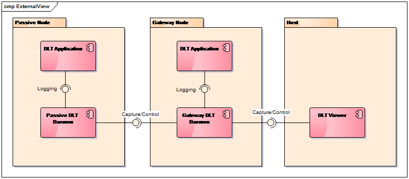

# DLT MultiNode

Back to [README.md](../README.md)

## Overview

MultiNode allows to connect DLT Daemons running on different operating systems,
e.g. in a virtualized environment. The central component is the Gateway DLT
Daemon which connects external DLT Clients, like the DLT Viewer running on a
host computer with Passive DLT Daemons running on nodes without a physical
connection to external DLT clients. All communication between passive nodes and
DLT Viewer has to be sent via the Gateway node. The Gateway node forwards log
messages coming from passive nodes to all connected DLT clients. The Gateway DLT
Daemon also forwards command and control requests coming from DLT clients to the
corresponding passive node.



## Precondition

The dlt.conf configuration file which is read by each DLT Daemon on start-up
contains an entry to specify the ECU identifier (node identifier). It has to be
ensured, that **each DLT Daemon in the System has a unique ECU** identifier
specified. The ECU identifier is included in every DLT Message and is used to
distinguish if a DLT message has to be forwarded to a passive node or handled by
the Gateway DLT Daemon itself.

## Configuration

The dlt.conf configuration file provides an option to enable the Gateway
functionality of a DLT Daemon. The default setting is 0 (Off), which means the
Gateway functionality is not available.

```
# Enable Gateway mode (Default: 0)
GatewayMode = 1
```

### Gateway Configuration File

The MultiNode configuration file has to be loaded by the Gateway DLT Daemon during startup.

Example:

```
[General]
Interval=1

[PassiveNode1]
; IP Address. (Mandatory)
IPaddress = 192.168.2.32
; TCP port. Default 3490 is used if no port is specified
Port = 3495
; Passive node ECU identifier. (Mandatory)
EcuID = ECU2
; Connection to passive node only on demand. Default ‘OnStartup’ if not specified
Connect = OnDemand
; Stop connecting to passive node, if not successful after 10 retries.
; Set to 0 for endless retry.
Timeout = 10
; Send following control messages after connection is established
SendControl=0x03, 0x13
; Send SerialHeader with control messages. Value in dlt.conf is used
; as default if not specified
SendSerialHeader=1
```

For more details, please refer to [dlt_gateway.conf.5.md](dlt_gateway.conf.5.md)

## Using DLT MultiNode

```
Usage: dlt-passive-node-ctrl [options]
Send a trigger to DLT daemon to (dis)connect a passive node or get current passive node status.

Options:
  -c         Connection status (1 - connect, 0 - disconnect)
  -h         Usage
  -n         passive Node identifier (e.g. ECU2)
  -s         Show passive node(s) connection status
  -t         Specify connection timeout (Default: 10s)
  -S         Send message with serial header (Default: Without serial header)
  -R         Enable resync serial header
  -v         Set verbose flag (Default:0)
```
